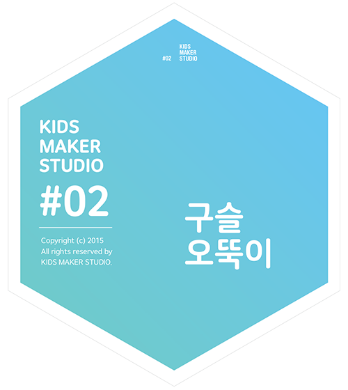

# 구슬 오뚝이

## 이 워크숍은 / About

### [매뉴얼 내려받기](pdf/2_roly_poly.pdf) 

## 개요 / Summary
구슬오뚝이를통해 물체의무게중심과 균형잡기를 생각해 봅시다. 구슬을 사용하여 무게 중심을 만들고 구슬의 위치에 따라 물체의 안정성이 어떻게 달라지는지 관찰합시다.

## 재료 / Materials

 * 종이컵 / 플라스틱 컵
 * 커피 컵 뚜껑
 * 유리구슬
 * 털실
 * 클립
 
 
 * 테이프
 * 가위

## 호기심 질문 / Questions
 1. 바닥이평평하지않은물건을세워둘수 있을까요?
 1. 검지손가락 위에 연필이나 노트를 올려 균형을 잡아 봅시다. 어떻게 하면 중심을 잡을 수 있을까요?

## 뚝딱거리며 생각하기 / Thinking in Tinkering

### 단계 / Step 1
클립에 털실을 묶어 커피 컵 돔 뚜껑에 붙인 다음 클립이 흔들리도록 합시다.

### 단계 / Step 2
클립이 멈추는 지점에서 클립을 컵 뚜껑에 붙이고, 같은 방법으로 털실이 묶인 클립을 하나 더 붙입니다.

### 단계 / Step 3
실끼리 만나는 지점에 구슬을 붙입니다.

### 단계 / Step 4
실과 클립을 떼어내고 플라스틱 컵을 뚜껑에 끼웁니다.

### 단계 / Step 5
오뚝이의 얼굴을 꾸며 봅시다.

### 변형 / Variation 1
구슬의 위치를 바꾸어 붙여보며 오뚝이 역할을 할 수 있는지 확인해봅시다.

## 회고 / Reflection
 1. 무게중심은 왜 항상 가운데일까요?
 1. 플라스틱 컵 말고 다른 재료를 쌓아 붙여 오뚝이를 만들 수 있을까요?
 1. 왜 오뚝이의 바닥 면은 둥글까요?

## 참고자료 / References
 * 공식 페이지 : http://protoroom.github.io/TinkeringWorkshop/#!kits/2_roly_poly.md

