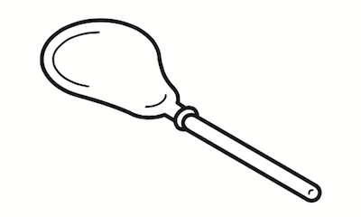
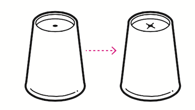
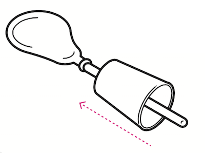
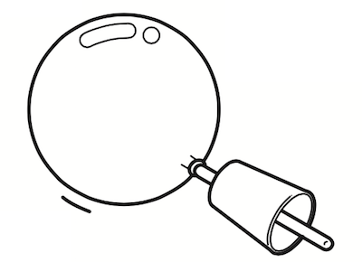
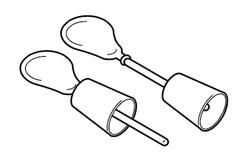
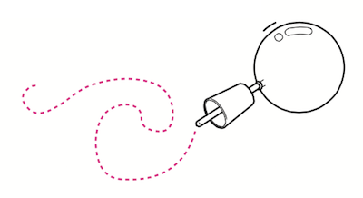

# 풍선 비행체

## 이 워크숍은 About

### [매뉴얼 내려받기](pdf/3_balloon_rocket.pdf) 

## 개요 Summary
비행기, 헬리콥터, 로켓 등 하늘에는 여러가지 비행체가 있습니다. 하지만 하늘에서 날면서 남기는 자취는 서로 다릅니다. 풍선에서 공기가 빠져 나가는 힘과 비행체의 모양에 따른 공기 저항 등의 작용에 따라 풍선 비행체는 다양한 자취를 남길 수 있습니다. 다양한 모양을 만들어 비행채의 자취를 관찰하고, 다른 사람의 비행체와 내 비행체의 차이점을 관찰합시다.

## 재료 Materials

 * 풍선
 * 종이컵
 * 12mm 빨대
 * 색종이
 
 
 * 가위
 * 송곳
 * 투명테이프

## 호기심 질문 Questions

 1. 하늘을 나는 비행 물체는 어떠한 것들이 있을까요?
 1. 하늘을 나는 비행 물체들이 지나간 흔적이 남는다면, 하늘에 어떤 그림이 그려질까요?

## 뚝딱거리며 생각하기 Thinking in Tinkering

### 단계 Step 1
풍선을 12mm 빨대에 연결합니다.

### 단계 Step 2
종이컵 바닥 가운데에 송곳으로 구멍을 뚫고 가위로 + 모양을 냅니다.

### 단계 Step 3
빨대를종이컵에끼우고빨대의 중간 부분까지 종이컵이 오게 한 다음 투명테이프로 붙입니다.

### 단계 Step 4
풍선을크게불어위로날려봅시다. 비행체가 나는 모습을 관찰합시다.

### 변형 Variation 1
종이컵의 위치를 바꿔보고 달라진 종이컵의 위치에 따라 어떻게 나는지 비교해 봅시다.

### 변형 Variation 2
종이컵 형태, 빨대의 길이 등을 다르게 하여 비행체가 날고 있는 모습의 자취를 관찰합시다.

## 회고 Reflection
 1. 내가 만든 비행체의 모양을 그려 봅시다.
  * [풍선 비행체 회고용지 내려받기](pdf/R_balloon_rocket.pdf)
 1. 내가 만든 비행체는 하늘에서 어떤 흔적을 남길까요?
 1. 다른 사람의 비행체와 내 비행체의 생김새와 날고 있는 모습은 어떻게 다를까요?
 
 

## 참고자료 References
 * 공식 페이지 : http://protoroom.github.io/TinkeringWorkshop/#!kits/3_balloon_rocket.md

