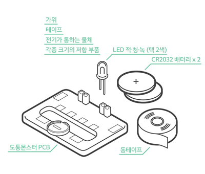
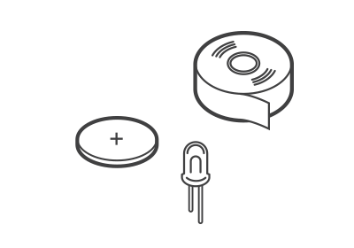
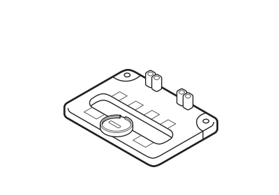
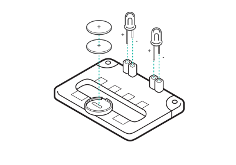
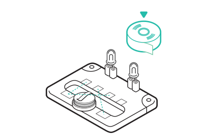
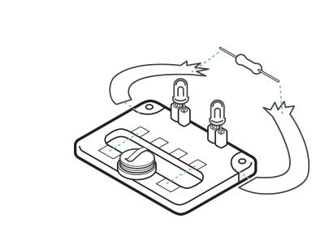

# 도통 몬스터

## 이 워크숍은 / About

### [매뉴얼 내려받기](pdf/4_dotong_monster.pdf) 

## 개요 / Summary
도통 몬스터는 빛을 내는 눈과 전기가 통하는 이빨을 가진 작은 전기괴물 입니다. 도통 몬스터를 통해 전기의 흐름(직렬, 병렬)에 대해 체험해보고, 전기가 통하는 물질과 저항이 다른 물질에 대해 이해합니다. 그리고 자신 만의 도통 몬스터를 꾸며보면서 기본적인 전기회로와 친해질 수 있습니다.

## 재료 / Materials

 * 도통 몬스터 PCB
 * 동테이프
 * LED 적, 청, 녹 (택 2색)
 * CR2032 배터리 2개
 
 
 * 가위
 * 테이프
 * 전기가 통하는 사물
 * 각종 크기의 저항 부품

## 호기심 질문 / Questions
 1. 도통 몬스터의 LED 눈을 어떻게 빛나게 할 수 있을까요?
 1. 우리 주변의 어떤 물체들이 전기가 통할까요?
 1. 전기가 통하는 물체들은 전기를 흘려보내는 정도가 서로 같을까요? 다를까요?

## 뚝딱거리며 생각하기 / Thinking in Tinkering

### 단계 / Step 1
도통몬스터 키트의 재료를 관찰해봅시다. 각 재료는 어떤 역할을 할지 상상해봅시다

### 단계 / Step 2
도통몬스터 PCB를 관찰해봅시다. 어떤 특징이 있는지 이야기해봅시다.

### 단계 / Step 3
도통몬스터의 눈인 LED를 연결해봅시다. LED는 모두 왼쪽이 +극입니다. 그리고 배터리를 꽂아주세요.

### 단계 / Step 4
전기가 통하는 이빨 부분에 동테이프를 연결해봅시다. 어떤 방식으로 연결하면 눈에서 빛이 나는지 실험해봅시다.

### 단계 / Step 5
전기 팔(동테이프)을 만들어보고, 그 사이에 일상의 사물들을 연결해봅시다.
어떤 종류의 물체에서 도통몬스터의 눈에 빛이 나는지 알아봅시다. 
다양한 종류의 저항을 연결해보고 빛의 밝기가 어떻게 변하는지 관찰해보세요.

## 회고 / Reflection
 1. 동테이프로 이빨을 연결했을 때 도통몬스터의 눈을 빛나게 하려면 어떤 방법들이 있었나요? 어떤 차이가 있는지 관찰해보고 이야기해봅시다.
 1. 전기가잘통하는사물과잘통하지않는 사물은 어떤 차이가 있는지 생각해봅시다.
 1. 도통몬스터의 팔에 다른 종류의 저항을 연결하면 빛의 밝기에도 변화가 생깁니다. 어떤 원리가 숨어있을까요?

## 참고자료 / References
 * 공식 페이지 : http://protoroom.github.io/TinkeringWorkshop/#!kits/4_dotong_monster.md

