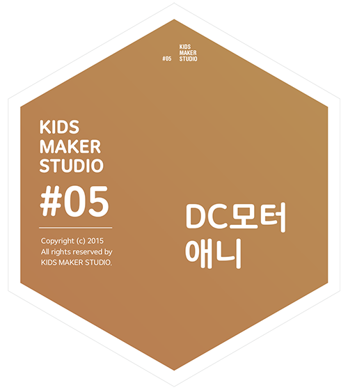
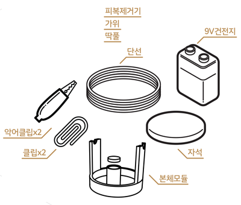

# DC모터애니

## 이 워크숍은 / About

### [매뉴얼 내려받기](pdf/5_motor_ani.pdf) 

## 개요 / Summary
DC모터애니는 자석과 코일로 회전 딱풀 운동을 합니다. 이를 통해 DC모터의 원리를 이해하고, 회전 운동을 이용해서 애니메이션 효과를 만들어 봅시다.

## 재료 Materials

 * 본체모듈 (3D 모델 파일 내려받기)
 * 단선 (24AWG)
 * 자석
 * 악어클립 2개
 * 금속클립 2개
 * 9V 건전지
 
 
 * 피복 제거기
 * 가위
 * 딱풀

## 호기심 질문 Questions
 1. 선풍기와 같이 전기로 회전운동을 만드는 모터는 어떤 원리로 동작하는 걸까요?
 1. 그림을 움직이는 것처럼 보이게 만들려면 어떻게 해야할까요?

## 뚝딱거리며 생각하기 Thinking in Tinkering

### 단계 / Step 1
딱풀을 이용해 그림처럼 단선을 6~8회 감아 코일을 만들어 봅시다. 단선의 양쪽 끝은 피복을 벗겨주세요.

### 단계 / Step 2
클립을 그림과 같이 구부려주세요.

### 단계 / Step 3
두 개의 구부린 클립을 본체의 상단 홈에 끼워주세요. 자석을 본체의 가운데 위치에 올려주세요.

### 단계 / Step 4
감은 코일을 그림과 같이 클립 위에 올려주세요. 양쪽 클립에 건전지의 양극과 음극을 각각 연결해주세요. 코일을 손으로 방향을 돌려 회전하는 방향을 찾아봅시다.

### 변형 / Variation 1
코일에 준비된 도안을 붙여 움직이는 그림을 만들어 보세요.

## 회고 Reflection
 1. 자석과 코일의 역할은 무엇일까요?
 1. 도안의 그림이 왜 움직이는 것 처럼 보일까요?

## 참고자료 References
 * 공식 페이지 : http://protoroom.github.io/TinkeringWorkshop/#!kits/5_motor_ani.md

