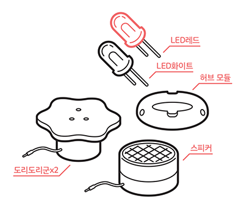
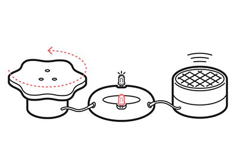

# 도리도리 전기

## 이 워크숍은 / About
 * 주제영역 : 메이킹, 과학/전기
 * 참가대상 : 5세이상 ~ 성인
 * 진행시간 : 30분 ~ 
 * 키트종류 : 경험용
 

### [매뉴얼 내려받기](pdf/6_doridori_elec.pdf) 

## 개요 / Summary
도리도리군은 손으로 도리도리를 시키면 그 힘이 전기로 변환되어 빛, 소리를 만듭니다. 도리도리군은 다른 도리도리군까지 움직이게 할 수 있습니다. 
이를 통해 전기가 발생하는 원리를 경험하고 전기의 힘이 움직임이나 빛 또는 소리로 변환되는 것을 느껴봅시다.

## 재료 / Materials

 * 도리도리군 2개 (3D 설계 내려받기)
 * 허브 모듈 (3D 설계 내려받기, PCB 설계 내려받기)
 * LED 흰색, 적색
 * 스피커

## 호기심 질문 / Questions
 1. 전기는 어떻게 만들어지는 걸까요?
 1. 전기로 선풍기와 같은 모터를 돌릴 수 있습니다. 반대로 모터를 돌리면 어떤 현상이 일어날까요?

## 뚝딱거리며 생각하기 / Thinking in Tinkering

### 단계 / Step 1
도리도리군을 허브에 연결해 봅시다.

### 단계 / Step 2
허브에 LED를 그림과 같이 방향을 다르게 연결해 봅시다.

### 단계 / Step 3
도리도리군을 좌우로 돌려 보면서 두 개의 LED상태를 확인해 봅시다.

### 변형 / Variation 1
스피커를 허브에 연결하고 도리도리군을 좌우로 돌릴 때 소리의 변화를 들어보세요.

### 변형 / Variation 2
도리도리군을 추가로 연결해서 돌려 봅시다.

## 회고 / Reflection
 1. 도리도리군(모터)을 돌렸는데 왜 빛,소리, 움직임이 만들어지는지 생각해 봅시다.
 1. 집 안에서 전기의 힘으로 작동하는 사물들 (빛, 소리, 움직임)로 어떤것이 있는지 생각해 봅시다.

## 참고자료 / References
 * 공식 페이지 : http://protoroom.github.io/TinkeringWorkshop/#!kits/6_doridori_elec.md

