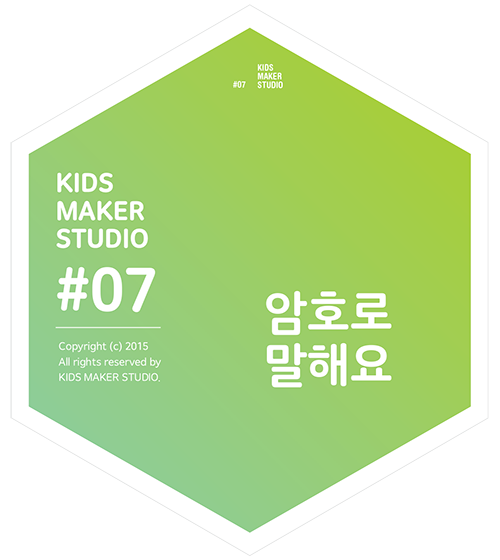
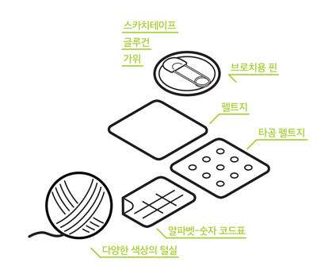

# 암호로 말해요

## 이 워크숍은 / About

### [매뉴얼 내려받기](pdf/7_weaving_code.pdf) 

## 개요 / Summary
암호로 말해요는 간단한 뜨개 놀이를 통해 컴퓨팅의 원리를 체험합니다. 알파벳 문자를 숫자화하고, 그 숫자를 다시 이진수로 코딩합니다. 이진수로 코딩된 알파벳을 털실과 펠트지를 이용해 자신만의 디자인을 더해 뱃지로 제작합니다.

## 재료 / Materials

 * 타공 펠트지
 * 펠트지
 * 다양한 색상의 털실
 * 알파벳-숫자 코드표
 * 브로치용 핀
 
 
 * 스카치테이프
 * 글루건
 * 가위

## 호기심 질문 / Questions
 1. 디지털 컴퓨터는 문자와 숫자를 어떻게 표현할까요?
 1. 0과 1만 써서 대화를 나눈다면 어떤 모습이 상상되나요?
 

## 뚝딱거리며 생각하기 / Thinking in Tinkering

### 단계 / Step 1
말하고 싶은 내용의 알파벳을 하나 고르고, 알파벳-숫자 코드표를 이용해 알파벳을 숫자로 바꿔 봅시다.

### 단계 / Step 2
0과 1의 색상를 정한 다음, 털실을 준비해 주세요.

### 단계 / Step 3
털실의 끝을 스카치테이프로 감으면 타공 펠트지에 끼우기가 편리해집니다.

### 단계 / Step 4
0과 1의 숫자에 맞춰 털실을 타공 펠트지에 통과시켜 주세요.

### 단계 / Step 5
털실이 안 빠지도록 서로 묶어주고 끝을 잘라주세요.

### 단계 / Step 6
암호를 포함한 채로 뱃지 모양을 만들어주세요.

### 단계 / Step 7
타공되지 않은 펠트지에 펠트 접착제를 이용해 붙여주세요.

### 단계 / Step 8
모양을 따라 자르고, 글루건으로 브로치용 핀을 뒤에 붙여 완성합니다.

### 변형 / Variation 1
두 글자 이상이 들어간 뱃지를 만들어 보세요.

### 변형 / Variation 2
메시지가 들어간 카드를 만들어보세요.

## 회고 / Reflection

 1. 털실이 아닌 다른 것으로 암호를 표현한다면 어떤 것이 있을까요?
 1. 숫자를 이용한 방법이 아닌 다른 방식으로 암호를 만들 수 있을까요?
 1. 이와같은 방법으로 일상에서 표현해 볼수있는 것이 있을까요?

## 참고자료 / References
 * 공식 페이지 : http://protoroom.github.io/TinkeringWorkshop/#!kits/7_weaving_code.md

