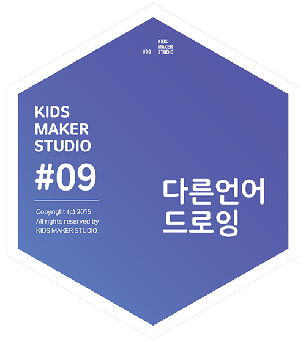

# 다른 언어 드로잉

## 이 워크숍은 / About
 * 주제영역 : 컴퓨팅/SW
 * 참가대상 : 초등 3년 ~ 성인
 * 진행시간 : 60분 
 * 키트종류 : 소프트웨어
 


### [매뉴얼 내려받기](pdf/9_2langs.pdf) 

## 개요 / Summary
  코드로 어떤 모양을 그리는 데에는 여러 가지 방법이 있습니다. 컴퓨터가 이해하는 코드를 이용해 간단한 도형을 그립니다. 컴퓨터도 다양한 언어의 코드가 있습니다. 다른 언어의 코드는 다른 관점을 제공합니다. 두 가지 다른 관점으로 디지털 드로잉을 경험해보고 두 접근이 어떤 차이가 있는지 알아 봅시다.

## 재료 / Materials


 * 웹사이트 : http://2langs.protoroom.kr
  * 소프트웨어 소스 저장소 : https://github.com/picxenk/TwoLangs
 * 인터넷 접속이 가능한 노트북 2인 1대
 * 최신 웹 기술을 지원하는 웹 브라우저 (예: 구글크롬)
 * A3 용지
 * 각종 필기구


## 호기심 질문 / Questions

1. 펜을 든 친구가 도화지 위에 사각형을 그리게 하려면 어떤 명령을 해야 할까요?
1. 펜을 든 친구가 도화지 위에 원을 그리려면 어떤 명령을 해야할 까요?
1. 공간의 바닥 전체가 도화지라고 상상해봅시다. 큰 펜을 든 친구가 우리의 명령만으로 거대한 도형을 그릴 것입니다. 친구가 다양한 도형을 그리려면 어떤 지시를 해쥐야 할까요?


## 뚝딱거리며 생각하기 / Thinking in Tinkering

### 단계 / Step 1 : 한 장 소개
각자 원하는 색상의 필기구를 들고, A3 용지 둘레에 자리를 잡습니다. 
각자의 이름을 적고 자신을 소개할 수 있는 단어를 적으면서 
인사를 나눕니다.

### 단계 / Step 2 : 손으로 그리는 드로잉
두 사람이 짝이 됩니다.
한 사람은 필기구를 들고, 다른 사람은 명령을 내려
사각형과 원을 그리는 실험을 해봅니다.
각 팀이 어떤 접근을 하는지 서로 이야기를 나눕니다. 
같은 도형을 그리기 위해서 사람마다 설명이 다를 수 있구나!

### 단계 / Step 3 : 다른 언어로 그리는 드로잉
2Langs 웹사이트로 접속합니다.
좌우의 코드를 읽어보고 어떤 그림을 그릴 지 상상해봅시다. 


#### 좌
```
home
go to 10 10 
repeat 4 [
  go 100 
  turn 90
] 
```
#### 우
```
line(120, 120, 220, 120) 
line(220, 120, 220, 220) 
line(220, 220, 120, 220) 
line(120, 220, 120, 120)
```

### 단계 / Step 4
좌우의 Draw 버튼을 클릭해서 어떤 그림이 나오는지 확인해 봅시다.
각 코드가 어떤 방식으로 그림을 그린 것일까요?
좌/우의 다른 방식으로 원을 그릴 수 있을까요?
어떤 접근이 가능할까요?

### 단계 / Step 5
왼쪽의 코드로 원을 그리는 방식에 대해서 이야기해봅시다. 오른쪽의 코드로 원을 그리기 위해서는 어떤 정보가 필요한지 이야기해봅시다. 코드는 꼭 영어일 필요는 없습니다. 한글 어휘의 코드를 이용해서 도형을 그려봅시다. 주어진 코드를 이용해서 원하는 그림을 그려보세요. 

#### 좌
```
이동하기 70 70 
반복하기 80 [
  움직이기 5 
  돌기 5
]
```
#### 우
```
선(120, 120, 220, 120) 
사각형(150, 150, 80, 100)
원(200, 100, 80)
```

### 변형 / Variation 1 : 원으로 원 그리기 / 여러개의 원
왼쪽의 코드로는 별 그리기를 시작으로 각도와 횟수를 달리해서 다양한 패턴을 실험해 볼 수 있습니다.

#### 좌
```
clear
home
goto 100 100 
repeat 5 [
  go 100 
  turn 144
]
```
#### 좌
```
home
goto 200 200 
repeat 75 [
  go 200
  turn 143 
]
```

### 변형 / Variation 2 : 원으로 원 그리기 / 여러개의 원
손으로 그리면 오래 걸릴 수 있는 반복적인 일을 컴퓨터는 쉽게 할 수 있습니다.

#### 좌
```
goto 100 100 
clear 
repeat 40 [
  repeat 40 [ 
    go 1
    turn 9
  ]
  go 10
  turn 9 
]
```
#### 우
```
clean()

for (i=0; i<5; i++) {
  for (j=0; j<5; j++) {
    circle(i*30+150, j*30+50, 10)
  }
}
```

## 회고 / Reflection
1. 두 가지 다른 관점을 가진 코드로 도형을 그려 본 느낌과 경험을 이야기해봅시다. 
1. 각 접근의 장단점이 있을까요? 어떤 도형을 그리기 좋은가요? 손으로 그리기와는 어떤 차이점이 있었나요?
1. 컴퓨터의 코딩은 결코 한 가지의 방법/관점만을 강요해서는 안됩니다. 여러 가지 관점을 가진다는 것은 어떤 의미일까요?

## 참고자료 / References
 * 공식 페이지 : http://protoroom.github.io/TinkeringWorkshop/#!kits/9_2langs.md

