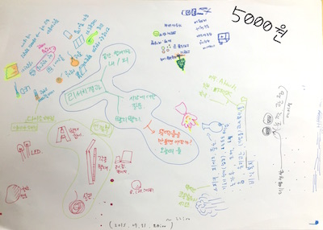
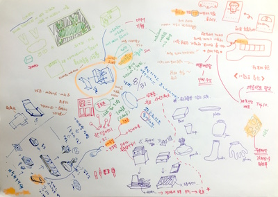

# 워크숍 개발 프레임워크 Framework

키즈 메이커 스튜디오 팅커링워크숍의 연구/개발 과정은 다음과 같습니다.

 * 브레인맵(BrainMap)을 통한 경험 공유 및 연구 방향을 설정합니다.
 * 워크숍 개발원칙을 세우고 워크숍 개발에 적용합니다.
 * 워크숍 아이디어 씨앗에 대한 미니워크숍을 진행하고 키트로 발전시킵니다.
 * 워크숍 진행에 대한 케이스스터디를 진행해 워크숍패턴을 도출합니다.

## 브레인맵
연구자의 미디어 워크숍 경험과 기존 무한상상실 뚝딱뚝딱공작실의 사례를 중심으로 키즈 메이커 스튜디오에 적용될 워크숍 콘텐츠의 방향을 설정하였습니다.

워크숍 콘텐츠의 방향을 토대로 워크숍의 **개발구조와 개발원칙**을 세웠습니다.

----
## 개발구조

#### **>> 워크숍의 주제 설정**
팅커링워크숍은 기존 뚝딱뚝딱공작실이 다루던 **공작 및 과학 주제**와 함께 **메이커 문화와 컴퓨팅 리터러시**의 주제를 추가하는 방향으로 개발합니다. 워크숍 주제는 크게 3가지 영역으로 구성됩니다. 

 * 공작하며 관찰하기 (Craft+Make)
 * 전기와 놀기 (Electric+Play)
 * 컴퓨팅 이야기 (SW/HW+Computing)

#### **>> 워크숍의 구조 설정**
각 워크숍은 키트와 함께 다음과 같은 구조를 갖습니다.

 1. 개요 (Summary)
 1. 재료 (Materials)
 1. **호기심 질문 (Questions)**
 1. **뚝딱거리며 생각하기 (Thinking in Tinkering)**
 1. **회고 (Reflection)**
 1. 참고자료 (References)

'호기심 질문 / 뚝딱거리며 생각하기 / 회고'는 체험형 워크숍에서 한 단계 더 나아가기 위한 팅커링워크숍의 핵심 구조입니다.

 
#### **>> 워크숍의 제약 설정**
 * **참여 대상의 제약**
  * 키즈 메이커 스튜디오에 참여하는 대상은 주로 중학생 이하의 아동과 자녀를 동반한 부모입니다.
 * **진행 시간의 제약**
  * 기존 뚝딱뚝딱공작실은 워크숍 대상에 따라 조금씩 변화가 있지만 보통 30분 ~ 1시간 이하의 진행이 이뤄졌습니다.
  * 팅커링워크숍은 1시간 이하의 진행을 기본으로 설정하고, 변화를 줄 수 있도록 하였습니다.
 * **키트 비용과 종류의 제약**
  * 키트의 구성과 관련하여 접근을 달리했습니다.
  * 배포형 키트와 경험용 키트로 구성하였습니다.
  * **배포형 키트**는 참여자가 워크숍 후에 결과물을 가져갑니다.
  * **경험용 키트**는 워크숍 내에서 경험을 전달하기 위해 사용되고, 배포되지는 않습니다.
  * 배포형 키트의 경우 재료키트와 패키지키트로 구성하였습니다.
  * **재료키트**는 키즈 메이커 스튜디오에 준비되어 있는 공통 재료들을 개별적으로 모아서 진행합니다.
  * **패키지키트**는 워크숍에 특화적으로 구성된 별도 재료 패키지를 통해서 진행합니다.
  * 참여자에게 배포가 되는 키트의 비용은 5000원 범위를 고려하였습니다.
  

----
## 개발원칙

#### **[ 오픈소스 워크숍 ]**
 * 팅커링워크숍의 모든 콘텐츠는 오픈소스 철학을 기반으로 합니다.
 * 이를 통해 앞서 연구된 내용과 시도를 존중하고, 앞으로 기여할 사람들에게 개선의 기회를 제공합니다.
 * 라이선스와 관련해서 더 자세한 사항은 [라이선스](license.md) 페이지를 참고하세요.

#### **[ 답을 주기보다 질문하기 ]**
 * 워크숍에서 경험하게 될 내용에 대한 호기심을 일으키는 질문을 던지는 것으로 시작합니다.
 * 어떤 정해진 답을 유도하기 보다는 다양한 경험과 관찰을 통해서 각자의 생각이 나올 수 있도록 유도합니다.
 * '워크숍 구조 > 호기심 질문'에 적용되었습니다.
  
#### **[ 내가 방금 뭐했지? ]**
 * 결과물의 완성으로 끝나는 워크숍이 아닌, 참여자가 경험을 되돌아볼 수 있는 활동으로 워크숍을 마무리합니다.
 * 간단히 소감을 나누는 회고를 넘어 각 나이에 맞춰 워크숍을 통해 했던 자신의 행동이나 결과물에 대한 관찰과 되새김을 일으키는 회고를 생각합니다.
 * 워크숍과 관련된 지식이나 기술을 단정적으로 전달하기 보다는 호기심 질문에서부터 시작된 궁금증을 참여자가 계속 안고가서 생활 속에서 다시 떠올릴 수 있는 기회를 만듭니다. 더 자세한 내용은 팅커링워크숍 웹페이지에서 추가로 참고할 수 있도록 만듭니다.
 * '워크숍 구조 > 회고'에 적용되었습니다.
 
#### **[ 결과물의 변주 ]** 
 * 딱 한 가지 만들기를 완성하는 것으로 끝나는 기존의 매뉴얼 방식에서, 따라하는 과정에서 생각을 일으키고, 변화를 줄 수 있는 부분을 추가합니다.
 * 각 워크숍은 변화의 요소를 넣어 여러 결과물이나 표현이 만들어질 수 있는 내용을 포함시킵니다.
 * 워크숍 과정에서 '변형'으로 적용되었습니다.

 
----
## 미니워크숍
팅커링워크숍에서 개발된 워크숍은 아이디어 씨앗에 대해 미니워크숍을 진행하면서 구체적인 내용과 키트로 발전시켰습니다. 미니워크숍은 아직 워크숍으로 완성되지 않은 소재에 대해 짧게 가상의 워크숍을 진행하면서 가능성을 탐색하는 과정입니다. 기본적으로 다음의 구조를 갖고 있습니다.

 * **10분 내 진행** - 아이디어의 핵심에 대해서만 체험할 수 있는 워크숍을 짧게 진행합니다.
 * **변화의 요소** - 하나의 경험에서 발생할 수 있는 여러 가지의 변화 요소를 찾고 발전시킵니다.
 * **긍정 피드백** - 미니워크숍 내용에 대해서는 부정적 비판이 아닌, 씨앗을 살리는 방향의 관점을 갖고 피드백을 줍니다.
 
미니워크숍은 마이크로티칭(Micro Teaching)과 저자워크숍(Writers' Workshop) 방법론에서 영향을 받았습니다.

----
## 패턴도출을 위한 케이스스터디
워크숍은 콘텐츠와 함께 참여자의 상호작용에 의해서 최종 완성이 됩니다. 워크숍 진행과정에서 여러 가지 경험과 교훈들이 쌓이게 되고, 이런 사례들이 기록되고 분석(Case-study)되어 패턴언어로 남겨졌을 때, 워크숍의 과정은 더 발전될 수 있습니다.

팅커링워크숍은 2016년 1월 이후 단계적으로 키즈 메이커 스튜디오에서 실행될 예정이며, 그 과정에서 발생하는 여러 케이스들을 패턴언어화하면서 노하우가 쌓이고 지속될 수 있는 콘텐츠가 되기를 기대합니다.

더 자세한 사항은 [워크숍패턴](pages/patterns.md)를 참고하세요.
