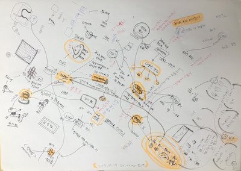

# 워크숍 개발 프레임워크 Framework

키즈 메이커 스튜디오 팅커링워크숍의 연구/개발 과정은 다음과 같습니다.
 * 브레인맵(BrainMap)을 통한 경험 공유 및 연구 방향 설정

## 브레인맵
연구자의 미디어 워크숍 경험과 기존 무한상상실 뚝딱공작소의 사례를 중심으로 키즈 메이커 스튜디오에 적용될 워크숍 콘텐츠의 방향을 설정하였습니다.

## 개발원칙

## 미니워크숍

## 패턴도출을 위한 케이스스터디